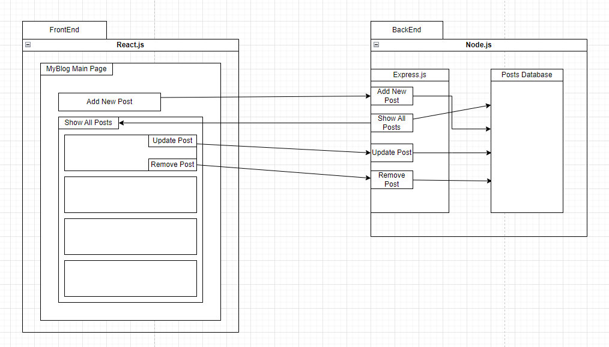

# React + Node Blog Application

This project is a simple blogging platform built using React for the frontend and Node.js with Express for the backend. It allows users to create, view, edit, and delete blog posts.

## Features

- **Create Posts:** Users can add new posts with titles and content.
- **View Posts:** All posts are displayed on the main page.
- **Edit Posts:** Users can edit the title and content of existing posts.
- **Delete Posts:** Users can remove posts.

## hld



## Getting Started

These instructions will get you a copy of the project up and running on your local machine for development and testing purposes.

### Prerequisites

Before running the project, make sure you have the following installed on your machine:
- **Node.js and npm (Node Package Manager)**: You can download them from [here](https://nodejs.org/).
- **React.js**: Ensure you have React installed. If you're setting up a new React project, Node and npm are required. React can be included in your project via npm by running `npm install react`.


### Installation

## Clone the Repository
First, clone the repository to your local machine. Open a terminal and run:

```bash
git clone https://github.com/yairb9/myBlog.git
```

## Backend Setup

Follow these steps to set up the backend server:

1. Navigate to the backend directory of your project:

    ```bash
    cd backend
    ```

2. Install the necessary dependencies by running:

    ```bash
    npm install
    ```

3. Start the backend server:

    ```bash
    npm start
    ```

Your backend server should now be running and listening for requests. By default, it will listen on `http://localhost:4000` unless configured otherwise.

## Frontend Setup

Once the backend is up and running, you can set up the frontend:

1. Open a new terminal window or tab and navigate to the frontend directory of your project:

    ```bash
    cd frontend
    ```

2. Install the necessary dependencies by running:

    ```bash
    npm install
    ```

3. Start the frontend development server:

    ```bash
    npm start
    ```

The frontend application should now be running and accessible via `http://localhost:3000`.

    ```


## Usage

- **Creating a Post:** Navigate to the main page, enter the title and content in the form, and submit.
- **Editing a Post:** Click the "Edit" button on any post, modify the title/content, and save.
- **Deleting a Post:** Click the "Delete" button on the post you wish to remove.

## Built With

- [React](https://reactjs.org/) - The web framework used for the frontend.
- [Node.js](https://nodejs.org/) - The runtime for the backend.
- [Express](https://expressjs.com/) - The web framework used for the backend.


## Authors

- **Yair Broyer** - *Initial work* - [yair9](https://github.com/yair9)

## License

This project is licensed under the MIT License - see the LICENSE.md file for details.


